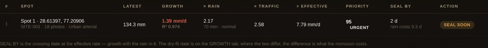

# RAAHI — crack growth prototype

**Team Innovators · SIH26198**

Photograph a crack. The app measures it, records where the photo was taken, and
recognises that spot again the next time somebody stands there. Once the same
crack has been photographed twice it has a growth rate — and a date by which it
needs sealing.

Nothing to install. Python's standard library only.

```bash
cd ~/Desktop/raahi
python3 server.py
```

The browser opens at <http://localhost:8000>. Stop it with `Control + C`.

---

## What it looks like


One crack, photographed eighteen mornings. Day one on the left, day eighteen on
the right, the growth between them, and above it the one verdict a ward engineer
actually reads.



The seal list, ordered by `growth × rainfall × traffic`, with every term and the
figure behind it printed in the row.


More screens, the full sixteen-page walkthrough, and a complete sample run —
input photographs and output JSON — are in **[`docs/`](docs/)**.

---

## What is new in this build

### 1. GPS out of the photograph itself

Drop a photo taken on a phone onto the CAPTURE tab and the backend reads its
EXIF block: latitude, longitude, altitude, the compass heading the camera was
pointing, the stated GPS accuracy, the moment the shutter fired, and the lens
focal length. Those numbers appear under **WHERE THIS PHOTO WAS TAKEN**, with a
link that opens the exact position on a map.

JPEG, HEIC and PNG (`eXIf` chunk) are all read. When a photo carries no
position — a webcam frame, a screenshot, a file whose metadata was stripped —
the browser's own geolocation is used instead, and the panel says which of the
two it was. Nothing is guessed silently.

### 1b. GPS *into* the photograph, at the shutter

A phone writes the fix into the file at the instant the shutter fires. A frame
off a webcam has no metadata at all — the browser hands over pixels and nothing
else — so `raahi_backend/geotag.py` writes one, before the bytes are stored:

| tag | what goes in |
| --- | --- |
| `GPSLatitude` / `GPSLongitude` (+ refs) | the fix, in degrees, minutes and seconds |
| `GPSAltitude` / `GPSAltitudeRef` | metres, and which side of sea level |
| `GPSImgDirection` | the compass heading, referenced to true north |
| `GPSTimeStamp` / `GPSDateStamp` | the moment of capture, in UTC |
| `GPSHPositioningError` | the stated accuracy, in metres |
| `DateTimeOriginal` | the shutter time on the camera's own clock |

After that the photograph carries its own evidence. Copy it out of
`data/photos/`, open it in any EXIF viewer or drop it on a map site, and the
coordinates are there — the record and the pixels cannot drift apart, which is
what a municipality would need if a repair bill were ever disputed.

**A photo that arrived with its own GPS is never rewritten.** The camera's word
beats ours, and the capture panel says which of the two happened.

JPEG (an APP1 segment) and PNG (an `eXIf` chunk) are written; anything else is
stored exactly as it arrived and reported as untouched.

### 1c. The shutter presses itself

A driver on a collection round has both hands on the wheel. On the CAPTURE tab,
**Capture photo** now watches its own preview and fires when a crack is in front
of it — the same shape test the still detector uses (thin, long, not filling the
frame, clearly darker than the tarmac), and it has to hold for three frames
running so a shadow or a passing wheel does not trigger it. Frames are checked
small and once a second; the full-resolution frame is what gets measured.

The checkbox turns it off. Every reading records whether the shutter was pressed
by a person or by the detector, and the report shows both counts.

### 2. Knowing it is the same spot tomorrow

This is the question the whole project rests on, and GPS alone cannot answer
it: a phone fixes its position to about 5–10 m, and two cracks 4 m apart are
different cracks. So three independent signals are combined in
`raahi_backend/geo.py`:

| signal | what it rules out | tolerance |
| --- | --- | --- |
| **Distance** — haversine between the two fixes | a different street | 15 m |
| **Heading** — GPS image direction | standing in one place, photographing two different edges of the road | 45° |
| **Appearance** — a 64-bit difference hash of the picture | everything else, and it works with no GPS at all | 12 of 64 bits |

A photo is the same spot when position **and** heading agree, or when the scene
is unmistakable on its own (7 bits or fewer). Position agreeing while the scene
disagrees is not silently accepted — the app says so and offers a manual
override, because a road looks different wet and that must not break the record.

Every match is explained in plain words: *"4.9 m from the recorded position;
camera pointing within 4 deg of before; scene matches (5/64 bits differ)"*.
Each further visit re-centres the spot on the average of its own fixes, so
tomorrow's match is tighter than today's.

### 2b. The formula: growth × rain × traffic

The deck's risk engine, implemented:

```
priority = growth rate (mm/day)  ×  rainfall forecast  ×  traffic
```

Only the first term is measured. The other two are stated multipliers, each in
its own module with its own reference value, and every answer carries the
working so a ward engineer can check it by hand:

> `1.390 mm/day × 2.17 rain × 2.58 traffic = 7.777 mm/day effective` → priority 95, URGENT

| term | module | how it is worked out |
| --- | --- | --- |
| **growth rate** | `growth.py` | Least squares over the readings actually stored for that spot, with R² beside it |
| **rainfall** | `rainfall.py` | `1 + expected mm over the next 14 days / 60`, capped at 5. One in a dry fortnight, so a dry-season priority is growth × traffic and nothing invented |
| **traffic** | `traffic.py` | `sqrt(commercial vehicles per day / 300)`, clamped 0.5–4. A residential lane is exactly 1.0 |

The product is an effective growth rate in mm/day — what this crack would do
with the rain and the traffic it actually faces. It is mapped to 0–100 on a log
scale between 0.05 and 10 mm/day, because the product spans orders of magnitude
and a straight line pins everything worth looking at to 100.

**What the numbers are, and are not.** Rainfall comes from a bundled table of
approximate monthly normals for Indian stations — a normal says what a fortnight
in September usually brings at that place, not what next fortnight will bring,
and the answer says `basis: "normal"` rather than calling it a forecast. Traffic
comes from a road-class table until somebody supplies a count. Both are
replaceable:

```bash
# a real forecast for one spot
curl -X POST localhost:8000/api/rainfall \
     -d '{"site_id": "SITE-001", "expected_mm": 240}'

# a real table of normals: name,lat,lon,jan..dec
cp imd_normals.csv data/rainfall_normals.csv     # picked up on the next start

# the road this spot is on
curl -X POST localhost:8000/api/sites/SITE-001/context \
     -d '{"road_class": "urban_arterial", "commercial_vehicles_per_day": 1850}'
```

The reference constants — 60 mm a fortnight, the 0.5 traffic exponent, the
score's floor and ceiling — are **chosen, not fitted**, and `/api/risk` returns
them under `assumptions` so nobody has to read the source to find that out. They
are the first thing to re-fit against a season of real readings.

The seal list also reports what the monsoon costs: the crossing date at the
measured rate, the crossing date at the effective rate, and the difference in
days between them.

### 3. Lead time

**Lead time is the number of days between the day a crack was first seen and
the day it is predicted to cross the sealing threshold.** It appears on the
SEAL LIST tab and per spot on GROWTH.

It only exists if somebody photographs the same square metre of road more than
once, which is why no Indian road authority reports it today. It is computed
honestly: a least-squares fit over the readings actually stored, with the fit
quality (R²) printed beside it, and a warning on the face of it when the fit is
loose. A spot with one photograph gets no rate and therefore no date — it sits
at the bottom of the list rather than being given an invented one.

### 3b. The report — one crack, end to end

The **REPORT** tab walks a single spot through the five boxes of the deck, in
order, on real readings only:

| box | what it shows |
| --- | --- |
| **1 · DETECT** | Passes stored, how many were measured, how many the shutter took itself, baseline against latest, growth since baseline |
| **2 · TRACK** | The position in decimal degrees and in DMS, the camera heading, how many passes carried a fix, how many came from the camera's own EXIF and how many RAAHI stamped in, the match radius |
| **3 · PREDICT** | Growth rate, R², threshold, predicted crossing, lead time, days left |
| **4 · SCHEDULE** | The formula worked out term by term, the priority and band, the seal-by date with the rain in it |
| **5 · VERIFY** | Whether the last pass continued the trend or broke it — a length that stops growing after a crew visited is what a seal looks like in the readings |

Under those, every pass day by day: the day number, the date, the length, the
growth since baseline, the position and its accuracy, whether the fix came from
the camera or was written by us, whether the shutter fired itself, and the
sentence explaining why that photo was matched to this spot.

It is also plain JSON at `GET /api/report/<site-id>`.

### 3c. Any number of photographs, uploaded at once

Choose as many files as you like on the CAPTURE tab — **two, five, eighteen, a
whole season**. They are measured and saved strictly in order, with a line per
file saying what happened to it. Order matters: the second photo of a spot has
to find the first one already in the record before it can be recognised as the
same place. Two photographs on different days is already a growth rate; more
days only make the date it predicts firmer.

Dates come from the photographs themselves. When a file has none — metadata
stripped by a chat app, a webcam frame, a screenshot — a day number is used
instead: from the file name (`day07.jpg`, `pass_7.png`), from the capture form,
or failing both, from the file's position in the batch. The first day number
seen for a spot fixes day one and the rest are counted from it, so a set of
undated photographs uploaded in one sitting lands on consecutive days instead
of collapsing into one and producing no rate at all. Every reading records
which of the three dated it, and the upload line says so.

### 3d. A second crack, and starting over

**A different crack at the same kerb** is the one case position, heading and
appearance cannot separate — two cracks a metre apart are inside every
tolerance the app has. So the person holding the camera says: tick *"This is a
different crack"* on the CAPTURE tab and the next upload opens its own spot,
leaving everything already recorded untouched. In a batch only the first
photograph may open the spot; the rest join it.

**Starting over** is on the SPOTS tab: *Clear every record* removes every spot,
reading and stored photograph. Calibration and the seal threshold survive,
because those describe the camera and the policy rather than the road.

### 4. A baseline to measure against

The GROWTH tab opens with the **baseline** — the first photograph of that spot —
next to the latest one, both full size, with the difference in millimetres
between them. Under it, every pass as a thumbnail with its length and date.

Growth is the number the app sells, and the reason is on the OVERVIEW tab:
absolute length carries a small constant bias, because a thick stroke's outline
adds its own width. In a subtraction a constant bias cancels exactly.

### 5. Detection quality — mAP per damage class

The DETECTION QUALITY tab reports average precision **per damage class**, on a
**named test split**, with the **sample size** — images and ground-truth
instances — printed next to every score. `raahi_backend/metrics.py` refuses to
produce a headline figure without a split name.

Until a real model is scored against real labels the tab stays empty and says
so, because this build measures crack growth and does not classify damage. To
score one:

```bash
python3 tools/eval_map.py \
    --gt   labels/rdd2022_india_val_xml \
    --pred runs/yolov8s_predictions.json \
    --split RDD2022-India-val \
    --model "YOLOv8s 640px, 60 epochs" \
    --post http://localhost:8000
```

`--gt` takes a Pascal VOC XML directory (the format RDD2022 ships in) or JSON;
`--pred` takes JSON with a score on every box. `--post` publishes the result
into the running app. Matching follows the standard VOC/COCO protocol, and both
AP@0.5 and AP@[.50:.95] are reported per class.

A worked example is in `tools/sample_eval/` — run it to see the output format
before you have a model.

### 6. Calibration is out of the user's way

Somebody photographing a road should not be asked to calibrate anything. They
see two buttons: **Upload photo** and **Capture photo**.

Millimetres are worked out on the server, from the best source available:

1. a calibration measured for that specific spot, if one exists;
2. the global calibration from the training tab, rescaled automatically if this
   photo is a different pixel width than the one it was measured on;
3. **the lens itself** — a 35 mm-equivalent focal length implies a 36 mm-wide
   frame, so focal length and shooting distance alone give millimetres per
   pixel with no reference object at all.
4. **an assumed phone lens**, when the photograph carries no lens data at all —
   a stripped file, a webcam frame. 26 mm equivalent is roughly the main camera
   on an iPhone or a Pixel, and every reading it produces says *assumed* on its
   face. Refusing outright was worse: the growth curve vanished and a first-time
   user was sent to calibrate before they had seen the app do anything. Growth
   is a subtraction, so a wrong constant scales both readings alike and largely
   cancels out of the number this app actually sells.

The calibration screen still exists, and it is unchanged in substance — it just
lives on the **TRAINING** tab, hidden until you click *training tools* in the
footer or open `?training=1`. Accuracy trials against a ruler and detector
scoring live there too.

---

## The tabs

| tab | what it is for |
| --- | --- |
| **00 OVERVIEW** | What this build does, what it does not, and where the data lives |
| **01 CAPTURE** | Upload or take a photo; measurement, position and spot match |
| **02 SPOTS** | Every place photographed, baseline and latest side by side |
| **03 GROWTH** | Baseline against latest, the curve, the verdict, the lead time |
| **04 SEAL LIST** | Ranked by growth × rain × traffic, every term shown |
| **05 REPORT** | One crack end to end: detect, track, predict, schedule, verify |
| **06 DETECTION QUALITY** | mAP per class on a named split, or an honest blank |
| **07 TRAINING** | Calibration, ruler trials, detector scoring — hidden by default |

---

## Try it without leaving the room

```bash
python3 tools/make_demo_photos.py --out demo_photos
```

This writes **eighteen** PNGs — one a morning, day 1 to day 18 — of a crack that
grows a little each day, each carrying a real EXIF block: GPS position jittered
by a few metres exactly as a real fix would be, capture date, camera heading,
focal length. Eighteen days is the deck's own answer for how long a growth
baseline takes.

Select the whole folder at once on the CAPTURE tab. Nothing is preloaded into
the database: the app reads their EXIF, works out on its own that they are the
same spot, and builds the growth curve, the lead time and the priority from
them. It comes out around 1.4 mm a day with R² near 0.97, a lead time near 28
days, and a crossing that the rain brings forward by about nine.

Then look at **GROWTH**, **SEAL LIST** and **REPORT**.

---

## Check that it all still works

```bash
python3 tools/selftest.py
```

Starts the server, writes real geotagged photographs, uploads them over HTTP,
and asserts 68 things about what comes back: that GPS is read from the file,
that later passes land on the same spot, that a photo 12 km away does not, that
the growth rate is positive, that a one-photo spot gets no invented date, that
`growth × rain × traffic` really multiplies out to the effective rate printed
beside it, that a supplied forecast replaces the bundled normals, that setting a
road class moves the traffic term, that a photo sent with no metadata comes back
off disk carrying the coordinates we wrote into it, that a photo with no lens
data still measures in millimetres and says the lens was assumed, that a
calibration displaces that assumption, that two undated photographs still yield
a rate and two points to draw, that a different crack at the same position opens
its own spot without disturbing the others, that clearing the round empties it
and keeps the calibration, that three files named
`day01`–`day03` land on three different days, that a photo which already had GPS
is never rewritten, that an unnamed split is refused, that a 100 mm reference
measures 100 mm, and that a deleted spot's id is never handed to a different
spot. Nothing is mocked — the detector in the test is the browser's own,
reimplemented in Python, so the figures it checks are the figures the app
produces.

---

## Layout

```
raahi/
├── server.py                  the whole server: static files + JSON API
├── raahi_backend/
│   ├── exif.py                EXIF/GPS from JPEG, HEIC and PNG
│   ├── geotag.py              EXIF/GPS *into* JPEG and PNG, at the shutter
│   ├── geo.py                 distance, heading, scene hash, revisit decision
│   ├── growth.py              least-squares growth rate, lead time, verdicts
│   ├── rainfall.py            monthly normals by station, or a real forecast
│   ├── traffic.py             commercial vehicles a day, by class or counted
│   ├── risk.py                growth × rain × traffic, ranked, with the working
│   ├── metrics.py             AP per class, COCO IoU sweep, VOC XML loader
│   ├── store.py               SQLite + the original photos
│   └── api.py                 the endpoints
├── web/
│   ├── index.html
│   ├── styles.css
│   └── app.js                 crack detection in the browser
├── docs/
│   ├── screenshots/           the app running, one image per screen
│   ├── sample-run/            one crack, 18 photographs — input and output
│   └── walkthrough/           the presentation guide, PDF and web page
├── docs/
│   ├── screenshots/           the app running, one image per screen
│   ├── sample-run/            one crack, 18 photographs — input and output
│   └── walkthrough/           the presentation guide, PDF and web page
├── tools/
│   ├── eval_map.py            score a detector from the command line
│   ├── make_demo_photos.py    eighteen days of geotagged demo photographs
│   ├── build_single_file.py   regenerate raahi.py from this source
│   ├── selftest.py            end-to-end check
│   └── sample_eval/           the JSON format, worked through
└── data/                      created on first run — SQLite + photos
```

`data/` is not committed. Delete it to start clean; copy it to move the whole
record to another machine.

`raahi.py` at the top of the repository is the same app as one file, with the
backend, the web pages and the demo writer embedded. It is generated — after
changing anything under `raahi_backend/`, `web/` or `tools/make_demo_photos.py`,
run:

```bash
python3 tools/build_single_file.py          # rebuild it
python3 tools/build_single_file.py --check  # or just ask whether it is stale
```

## API

| method | path | what it does |
| --- | --- | --- |
| GET | `/api/state` | counts, calibration, fleet lead time |
| GET | `/api/sites` | every spot with its growth report |
| GET | `/api/sites/<id>` | one spot, with every observation |
| GET | `/api/schedule` | the ranked seal list, every term of the formula shown |
| GET | `/api/risk` | the formula's working per spot, its terms and its assumptions |
| GET | `/api/report/<id>` | one crack: detect, track, predict, schedule, verify |
| GET | `/api/rainfall?lat=&lon=&days=` | expected rain at a position, and where the figure came from |
| GET | `/api/traffic` | the road-class table and each class's factor |
| GET | `/api/metrics/detection` | the latest per-class mAP, or an honest blank |
| GET | `/photo/<sha>` | the photograph as stored — with the GPS we wrote into it |
| POST | `/api/observations` | a photo plus what the browser measured in it |
| POST | `/api/sites/<id>/context` | road class, vehicle count, rainfall override, ward |
| POST | `/api/rainfall` | a real forecast for one spot, or a CSV of normals |
| POST | `/api/calibration` | training only |
| POST | `/api/threshold` | change the seal threshold |
| POST | `/api/metrics/detection` | score a detector |
| POST | `/api/trials` | record an accuracy trial against a ruler |
| DELETE | `/api/sites/<id>`, `/api/observations/<id>`, `/api/trials` | |

Everything runs on localhost. No external calls, no dependencies, no data
leaves the machine.

## Limits, stated plainly

* No trained damage classifier. Detection is thresholding, morphology and
  connected components — not a model. The RDD2022 class labels on the seal list
  come from whoever typed them.
* No detection score to quote yet. The published reference point is CRDDC'2022,
  best team F1 0.769 on RDD2022 — that is what we are aiming at, not our result.
* Runs on a laptop or a phone browser, not on a truck.
* Daylight, close range, camera roughly overhead. Not heavy rain.
* Absolute length carries a small constant bias. Growth is a subtraction, so
  the bias cancels — that is why growth is the number reported.
* **No live weather feed.** The rain term uses bundled monthly normals for Indian
  stations — approximate published figures, rounded — which say what a fortnight
  usually brings, not what next fortnight will bring. Every answer says
  `basis: "normal"`. Post a real forecast and it is used instead.
* **No traffic counts.** The traffic term uses road-class defaults until a
  municipality supplies its own, and every answer says which it used.
* The multipliers' constants are chosen, not fitted. They rank spots against
  each other honestly; they are not a physical model of crack growth, and
  `/api/risk` says so in its own output.

## Camera notes

The camera needs the local server: run `python3 server.py` and use
`http://localhost:8000`, not a `file://` path. Uploading a photo works either
way — and an uploaded phone photo carries GPS, which a webcam frame does not.
