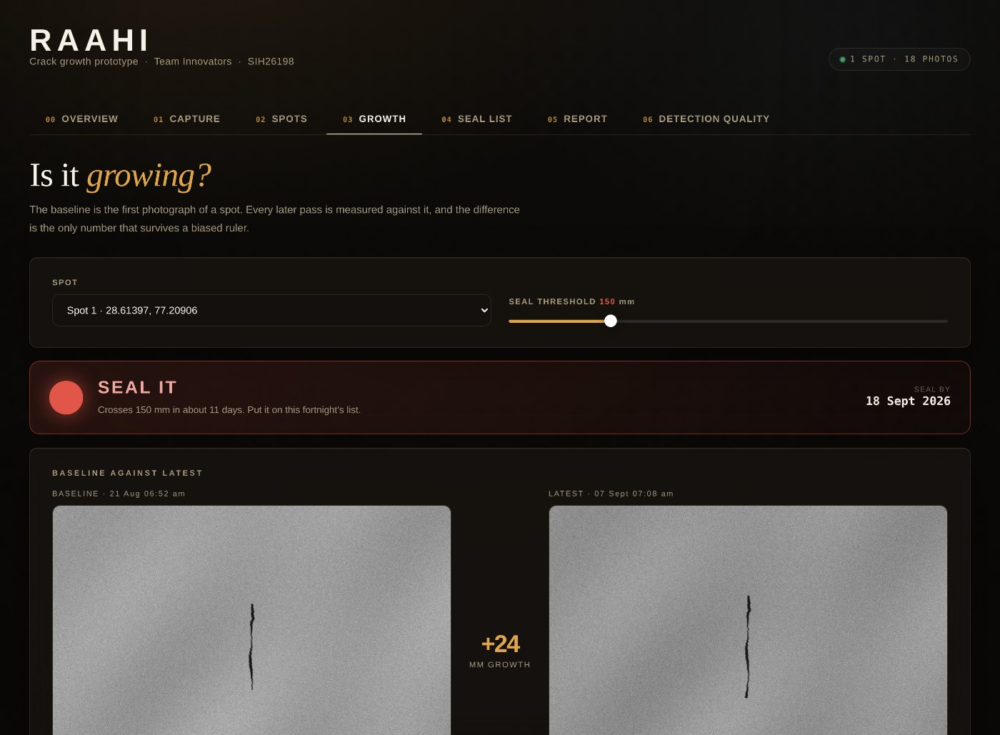
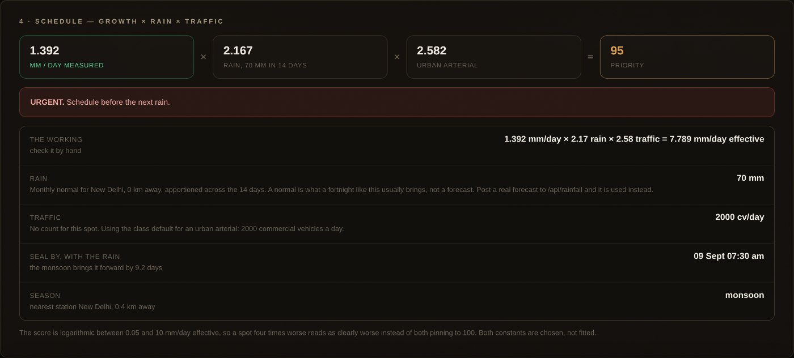
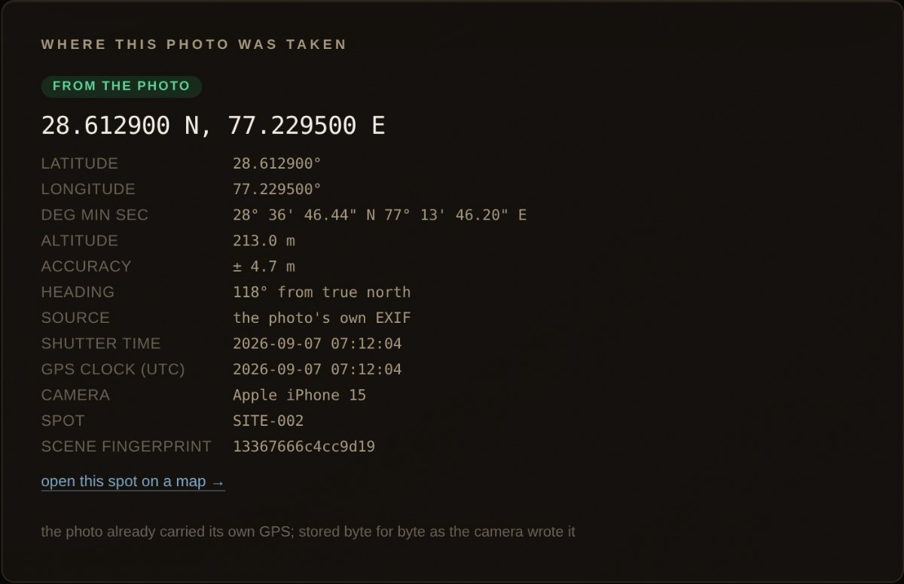

# RAAHI

### Every pothole was once a crack that nobody sealed in time.

Seal a crack and it has a **1%** chance of becoming a pothole. Leave it and the
chance is **75%**. The treatment costs a fraction of the repair, the evidence has
been settled since the 1990s, and every municipal engineer in India already knows
it.

They still cannot act on it, because sealing only pays if you do it *at the right
moment* — and nobody can tell you when that is. A crack photographed once is a
defect with no date attached. There is no number in Indian road maintenance that
says *this one, by Friday*.

**RAAHI produces that number.** It photographs the same square metre of road on
successive mornings, measures how much the crack grew between visits, and turns
the growth rate into a sealing date.



---

## Seeing it work takes thirty seconds

Python 3 and nothing else. No install, no dependencies, no API keys, no internet.

```bash
python3 raahi.py demo     # writes 18 geotagged photographs of a crack that grows
python3 raahi.py          # opens the app in your browser
```

On the **CAPTURE** tab press *Choose photos*, select all eighteen, and watch them
go in. Then open **GROWTH**.

The app has no idea those photographs are synthetic. It reads their GPS, works
out on its own that they are the same crack, measures each one, and builds
everything below from them. Nothing is preloaded — [and the repository ships no
database, deliberately](docs/README.md#what-is-deliberately-not-in-here).

---

## What eighteen photographs produced

Real output from the run committed in [`docs/sample-run/`](docs/sample-run/) —
input photographs and raw JSON, so every figure here can be checked.

```
18 photographs, 17 days      110.1 mm  →  134.3 mm        +24.2 mm

growth rate     1.392 mm/day        least-squares fit, R² 0.974
lead time       28.3 days           first sighting → predicted failure
crosses 150 mm  18 September        at the measured rate
                12 September        with the monsoon in it — the rain costs 6 days
priority        77 · URGENT         1.392 mm/day × 2.17 rain × 1.00 traffic
verification    ON TREND            last pass gained 1.4 mm against an expected 1.4
```

Seventeen of those eighteen were revisits, and the app matched every one of them
by itself. It explains each match in words a person can check — this is pass two,
verbatim from the screen:

> 1.2 m from the recorded position; camera pointing within 4 deg of before;
> scene matches (1 of 64 bits differ)

---

## The one number nobody else has

**Lead time is the gap between the day a crack is first seen and the day it is
predicted to cross the sealing threshold.**

It cannot be derived from a survey, a satellite pass, or a citizen complaint. It
requires the same camera to return to the same metre of road, repeatedly, over
weeks. No survey van does that — they are too expensive to run daily. No
complaint app does it — nobody reports a crack, they report the pothole it
became.

A municipal waste fleet already does it. Every morning. Down every lane. For
free.

That is the whole idea: **the fleet that already returns is the sensor nobody
thought to use.**

---

## The three problems worth solving

Detecting a crack in one photograph is a solved problem, and we make no claim to
have improved on it. Measuring the *same* crack over weeks is where the work is.

### 1 · Is this yesterday's crack?

A phone fixes its position to about ± 5 m. Two cracks four metres apart are
different cracks. **GPS alone cannot answer this**, and any reviewer who knows
GPS will say so immediately — so we never rely on it alone.

Three independent signals vote:

| signal | what it rules out | tolerance |
| --- | --- | --- |
| **Distance** — haversine between the two fixes | a different street | 15 m |
| **Heading** — the compass bearing the camera was pointing | standing in one place, photographing two different edges of the road | 45° |
| **Appearance** — a 64-bit difference hash of the picture | everything else, and it works with no GPS at all | 12 of 64 bits |

A photo is the same spot when **position and heading agree**, or when the
**scene alone is unmistakable**. Every decision is printed in plain words, and a
position that matches while the picture disagrees is flagged rather than
silently accepted — a road looks different wet, and that must not corrupt the
record.

The appearance hash compares whether each coarse patch of the picture is brighter
than the patch to its right. That makes it **blind to exposure** — the thing that
changes most between a 7 a.m. and a 9 a.m. pass — while staying sensitive to the
layout of the scene. Across the eighteen demo passes, deliberately shot at
different exposures, the fingerprint never drifted more than 2 bits of 64.

Each revisit re-centres the spot on the average of its own fixes, so tomorrow's
match is tighter than today's.

### 2 · How many millimetres is that?

Nobody photographing a road should be asked to calibrate anything. There is one
button: *Choose photos*.

Millimetres are worked out on the server, from the best source available, and
every reading says which one was used:

1. a calibration measured at that specific spot;
2. the global calibration, rescaled automatically if this photo is a different
   pixel width;
3. **the lens itself** — a 35 mm-equivalent focal length implies a 36 mm-wide
   frame, so focal length and shooting distance alone give millimetres per pixel
   with no reference object at all;
4. an **assumed** 26 mm phone lens, when the file carries no lens data — labelled
   *assumed* on the face of every reading it produces.

**And absolute length is not the number we sell.** A traced outline adds its own
width, every time — a small constant bias. In a subtraction a constant bias
cancels exactly, so *growth* survives a biased ruler where *length* does not.
That is why growth is what this app reports, and it is the honest answer to
"how do we trust your millimetres?"

### 3 · Which crack first?

Two cracks growing at the same rate are not equally urgent. One is under a
monsoon sky on a truck route; the other is on a dry residential lane. The seal
list is ordered by:

```
priority  =  growth rate  ×  rainfall  ×  traffic
             mm/day          factor      factor
             measured        stated      stated
```

Only the first term is measured. The other two are stated multipliers, each with
its own reference value, and **the app prints the arithmetic** so a ward engineer
can check it by hand:



| term | how it is worked out | reference |
| --- | --- | --- |
| growth | least-squares fit over the readings stored for that spot | measured |
| rainfall | `1 + expected mm ÷ 60`, capped at 5 | one in a dry fortnight |
| traffic | `√(commercial vehicles per day ÷ 300)`, clamped 0.5–4 | a residential lane is 1.0 |

Commercial vehicles, not total traffic, because it is axle load rather than
vehicle count that breaks a road.

The product is an effective growth rate in mm/day, mapped to 0–100 on a
logarithmic scale between 0.05 and 10. Logarithmic because the product spans
orders of magnitude, and a straight line would pin everything worth looking at
to 100 — at which point the ranking stops ranking.

**The rainfall reference, the traffic exponent, and the score's floor and ceiling
are chosen constants, not fitted ones.** `GET /api/risk` returns them under
`assumptions`, so nobody has to read the source to find that out. They are the
first thing to re-fit against a season of real readings.

---

## What we do not claim

Every one of these is stated inside the app as well, on the tab where it matters.

- **No trained damage classifier.** The crack is found by thresholding,
  morphology and connected components — not by a model. The DETECTION QUALITY
  tab is therefore empty, and says so. We would rather show a blank than a
  number we did not measure.
- **No live weather.** The rainfall term uses published monthly normals for
  Indian stations. A normal says what a September fortnight *usually* brings, not
  what next fortnight will bring, and the API labels it `normal` — never
  "forecast". Post a real IMD figure and it is used instead.
- **No traffic counts.** Road-class defaults until a municipality supplies its
  own. Every answer says `counted` or `assumed`.
- **Runs on a laptop, not on a truck.** The edge deployment is designed, not
  built.
- **Daylight, close range, camera roughly overhead.** Not heavy rain.
- **A crack photographed once gets no rate, no date, and no colour.** It shows
  grey, never green. *"We never went back"* is not the same claim as *"we checked
  and it is fine"* — and treating them as equal is exactly how road condition
  data goes wrong everywhere else.

---

## How it differs from what exists

|  | RAAHI | Survey van (NSV) | Crack-detection app | Complaint portal |
| --- | --- | --- | --- | --- |
| **Finds** | cracks **and their growth rate** | full distress survey | cracks in one pass | potholes, after failure |
| **Answers** | which crack, and **when** | what condition is it in | is there a crack here | who complained loudest |
| **Frequency** | daily | periodic, often annual | once per survey | event-driven |
| **Cost per km** | near zero — the truck was already driving | very high | low | free, but biased |
| **Repair check** | automatic, next pass | none | none | manual inspection |
| **Coverage bias** | fleet routes, reported openly | surveyed corridors only | whoever drove it | wealthier, vocal wards |

---

## What is in the app

Seven tabs. The [sixteen-page walkthrough](docs/walkthrough/Reading-the-RAAHI-Prototype.pdf)
explains each one in full, with every number named. For what is happening
underneath — every algorithm, every constant, and fifty questions with answers
ready — there is the [technical defence](docs/defence/RAAHI-Technical-Defence.pdf).

| tab | what it is for |
| --- | --- |
| **00 Overview** | What the build does, and the limits it states up front |
| **01 Capture** | Upload or photograph; detection, measurement, position, spot match |
| **02 Spots** | Every place photographed, and where to clear the round |
| **03 Growth** | The seal light, baseline against latest, the curve, the lead time |
| **04 Seal list** | Ranked by growth × rain × traffic, every term shown |
| **05 Report** | One crack end to end: detect, track, predict, schedule, verify |
| **06 Detection quality** | Deliberately empty, and it explains why |

### Worth demonstrating live

**Upload the whole folder at once.** Two photographs, eighteen, fifty-four — they
go in as a batch, in order, with a line each saying what happened and why it was
matched to the spot it was. Everything in the record then appears as a grid of
thumbnails on the same tab; any one can be removed, and the growth rate, the
date and the seal list recalculate from what is left.

**The photograph carries its own coordinates.** A webcam frame has no metadata,
so RAAHI writes the position, heading, altitude, UTC satellite clock and accuracy
into the file's own EXIF as it stores the photograph, exactly as a phone does.
Copy the file anywhere, open it in any EXIF viewer, and the coordinates are
there — the record and the pixels cannot drift apart. A photograph that arrived
with its own GPS is never rewritten.



---

## Under the hood

```
raahi.py                 the whole app as one file — mail it, run it
server.py                the same app, from the source tree

raahi_backend/
  exif.py                read GPS, heading and lens data from JPEG, PNG, HEIC
  geotag.py              write GPS into JPEG and PNG when the file carries none
  geo.py                 distance, heading, scene hash, the revisit decision
  growth.py              least-squares rate, lead time, verdicts
  rainfall.py            monthly normals by nearest station, or a real forecast
  traffic.py             commercial vehicles a day, by class or counted
  risk.py                growth × rain × traffic, ranked, with the working
  metrics.py             AP per damage class, COCO IoU sweep, VOC XML loader
  store.py               SQLite and the original photographs
  api.py                 the endpoints

web/app.js               crack detection in the browser
tools/selftest.py        68 end-to-end checks
docs/                    screenshots, a full sample run, the walkthrough,
                         the technical defence
```

Every module opens with a comment explaining not just what it does but why it is
built that way, and which assumptions it is making. The reasoning is in the
source, not only in this file.

### The API

| method | path | |
| --- | --- | --- |
| `GET` | `/api/state` | counts, calibration, fleet lead time |
| `GET` | `/api/sites` · `/api/sites/<id>` | every spot, or one with its observations |
| `GET` | `/api/schedule` | the ranked seal list, every term of the formula |
| `GET` | `/api/risk` | the formula's working, its terms, its stated assumptions |
| `GET` | `/api/report/<id>` | one crack: detect, track, predict, schedule, verify |
| `GET` | `/api/rainfall?lat=&lon=` | expected rain, and where the figure came from |
| `GET` | `/api/observations` | every photograph in the record, for the gallery |
| `POST` | `/api/observations` | a photo plus what the browser measured in it |
| `DELETE` | `/api/observations/<id>` · `/api/records` | remove one photograph, or all of them |
| `POST` | `/api/sites/<id>/context` | road class, vehicle count, ward |
| `POST` | `/api/rainfall` | a real forecast, or a CSV of real normals |

Everything runs on localhost. No external calls, no dependencies, nothing leaves
the machine.

### Checking that it works

```bash
python3 tools/selftest.py
```

Starts a server, writes real geotagged photographs, uploads them over HTTP, and
asserts **68 things** about what comes back — that GPS is read from the file,
that later passes land on the same spot, that a photo 12 km away does not, that
`growth × rain × traffic` really multiplies out to the effective rate printed
beside it, that a supplied forecast displaces the bundled normals, that a photo
sent with no metadata comes back off disk carrying the coordinates we wrote into
it, that a deleted spot's id is never reissued.

Nothing is mocked. The detector in the test is the browser's own, reimplemented
in Python, so the figures it checks are the figures the app produces.

---

## Where the claims come from

- **RDD2022** (Arya et al.) — 47,420 road images from six countries including
  India, 55,000+ annotated instances, smartphone-captured.
  [arxiv.org/abs/2209.08538](https://arxiv.org/abs/2209.08538)
- **75% / 1%** — Pavement Preservation & Recycling Alliance, roadresource.org
- **Return on preventive maintenance at the correct time** — NCHRP Synthesis 223
  (Geoffroy, 1996) reports 1 : 3–4 in avoided rehabilitation; Galehouse,
  Moulthrop & Hicks (2003) report 1 : 6–10
- **Indian standards** — IRC:82 (maintenance of bituminous surfaces), IRC SP:16,
  MoRTH RW/NH-33044/32/2019, DPDP Act 2023, State PWD Schedule of Rates

---

<sub>**Team Innovators** · Smart India Hackathon 2026 · Problem statement SIH26198 ·
Transportation & Logistics</sub>
